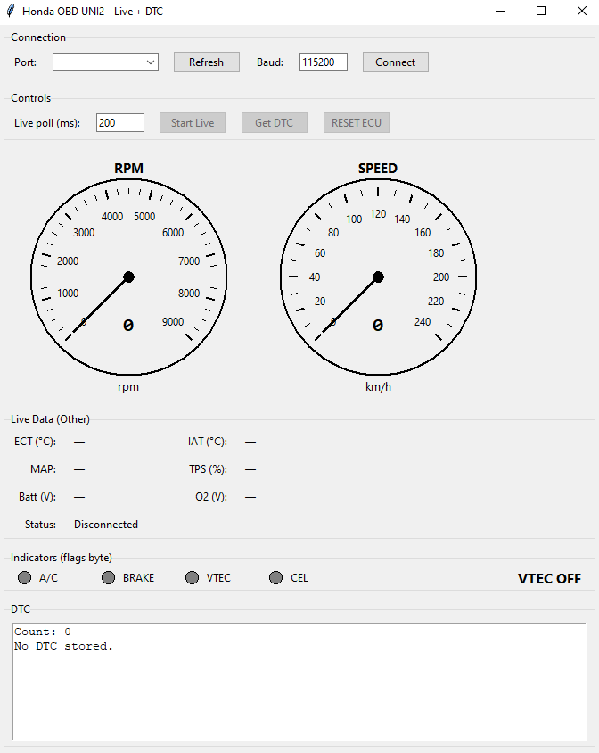

# Arduino obd1 project
```
1 wire obd1 decoder
currently works by connecting to a laptop 
    - could probably extend to be bluetooth
```

## Gui looks like this
- flags and all that here 
- can roll back to f74e1f8 to have a purely text based one (no gauges)


